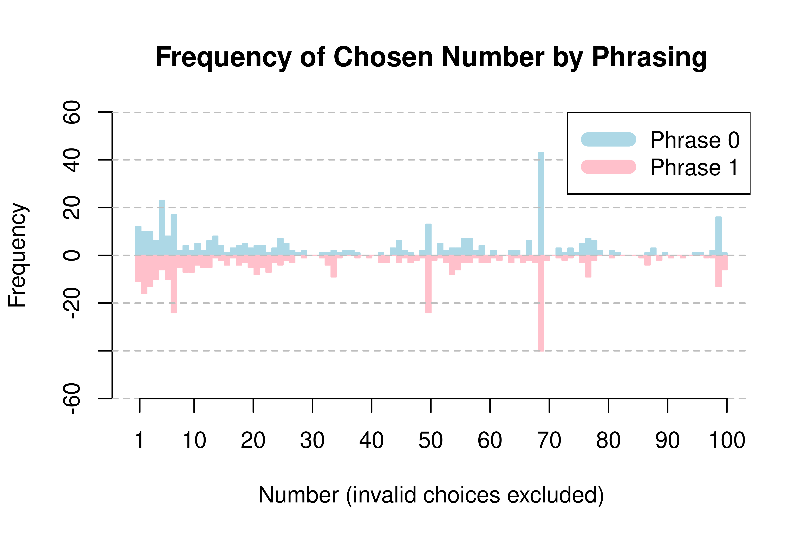

# Omegle Experiment

This was a proof of concept which aimed to demonstrate the feasibility of using [Omegle](https://en.wikipedia.org/wiki/Omegle) (a free, anonymous, online chatroom) as a medium for simple social experiments. The website has since been [shut down](https://www.bbc.co.uk/news/business-67364634) so the methods described are void.

All code is released under the MIT license alongside the original data collected (including [random messages](https://github.com/Foggalong/Omegle-Experiment/blob/main/Bot/output.dat#L94) and [spam](https://github.com/Foggalong/Omegle-Experiment/blob/main/Bot/output.dat#L1949)).

## Example Study

The question we aim to answer in this proof of concept is very simple:

> _When asking someone to pick a number between 1 and 100 (inclusive), does the phrasing of the interval have an impact on the range of numbers chosen?_

To answer this we conducted a small experiment.

### Collecting Data

When using Omegle, users are paired with another user at random and placed in an anonymous room to chat. To collect the data, we [created a bot](Bot/bot.py) which can be used to communicate with Omegle users. This was written in Python 2 and utilised a [modified version](Bot/omegle.py) of the [`py-omegle`](https://code.google.com/p/py-omegle/) module.

Once the bot successfully connected to a user, it used one of two set phrasings at random to ask them to choose a number:

1. _"Pick a number between 1 and 100"_,
1. _"Pick a number between 100 and 1"_.

The user was then given 10 seconds to respond, during which time the bot recorded any responses and then disconnected.

### Data Collected

Over the period the experiment ran the bot connected to 6365 users. These users are not necessarily distinct; due to the anonymous nature of Omegle there is no way to detect duplicates in the data.

User responses were [sorted using bash](Analysis/analysis.sh). A message was marked as a 'valid' response if it was a number between 1 and 100, typed with numerals rather than text, and no other content. All other responses were 'invalid'. Some users did not respond to the bot within the time limit, so were recorded as 'none'.

Response  | Phrase 1 | Phrase 2 |   Total |
:-------- | -------: | -------: | ------: |
Valid     |      347 |      372 |     719 |
Invalid   |     1479 |     1538 |    3017 |
None      |     1313 |     1316 |    2629 |
**Total** | **3139** | **3226** |**6365** |

Roughly 11% of connections resulted in a valid response to the experiment, relatively low for such a simple question. That said, there's very little barrier to generating more responses to make up for this.

In addition to the intended data, the bot received 5301 non-number messages from connected users. These were a combination of invalid responses, and messages sent by users before or after a valid response. Of these 2600 came after phrase 1, and 2701 after phrase 2.

### Analysis

After cleaning, we used R to [create a butterfly plot](analysis/) of the chosen numbers.

We see remarkable similarity between the two phrasings. Both have significant peaks at 69, 50, and 99, as well as general periods of high frequency for 1 through 7. On appearance, outwith random fluctuations there looks to be **no significant differences in distribution depending on how the question was asked**.

## Data Protection

This experiment ran for ~24 hours back in ~2013. It was a pre-GDPR era and the published data includes _everything_ any user responded with, including many [Kik](https://en.wikipedia.org/wiki/Kik_Messenger) usernames and at least one phone number. It also ran with no regard for Omegle's own data protection policies.

With hindsight, the very obvious blocker to using the described methodology is that it gives participants zero control; they can't opt-in, they can't opt-out. While the ramifications of this for a simple question like _"pick a number"_ are relatively small, it obviously wouldn't be sensible or fair to repeat this without proper safeguards in place.

If you participated in this study and are concerned about your data, please get in touch.
